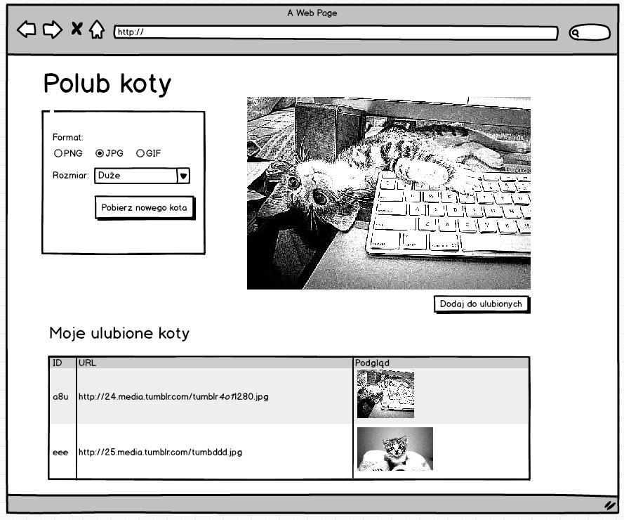

# Javascript

# Learn

1. Follow the [Javascript](https://www.codecademy.com/learn/javascript) course.
1. Follow the [jQuery](https://www.codecademy.com/learn/jquery) course.

# Task

1. Put a life in your login form - allow to login into your application with some hardcoded user credentials. 
Remember about appropriate error message when the username and password does not match.
1. After signing in, the login form should disappear and your first web application should be shown instead. It should look like: 
1. App features:
 1. Display random cat images form [The Cat API](http://thecatapi.com/).
 1. Ability to specify format and size of the random cat image.
 1. Ability to add the currently displayed cat image to the favourite list.
 1. Display picture info and a thumbnail of the images that have been added to favourites in a table.

# Hints

1. Use Materialize CSS framework to style your app.
1. Hide the app with CSS before user is signed out.
1. After successful login (check if the username and password matches one you have hardcoded), hide the login form and show the application with jQuery.
1. Collect the data from form with JS and request a cat image from the API (you may find [the docs](http://thecatapi.com/docs.html) useful).
 1. Exapmle request URL: http://thecatapi.com/api/images/get?format=xml&results_per_page=1&size=small&type=png
 1. Consume the photo data in XML format and read the data you are interesed in with jQuery.
 1. If the jQuery course does not introduce how to fetch a data from a remote server, read about [`jQuery.ajax`](http://api.jquery.com/jquery.ajax/) method.
1. When user adds displayed image to favourites, use previously fetched data and jQuery to add next row to favourite cats table.
1. Don't worry if your favourites cats are lost when you refresh the page - it's normal as we do not persist the list anywhere.
1. Commit your work after each logical step. If you are comfortable enough, try working with local branches. Write commit messages in english imperative.

# Bonus

1. Sign out
1. Remove pictures from favourite list
